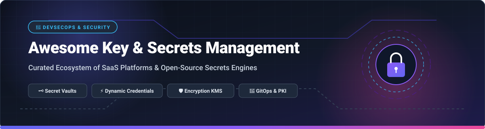

# 🔐 Awesome Key & Secrets Management

  

  
  
  
  
  
  

> **Curated Ecosystem of SaaS Platforms, Enterprise Cloud KMS & Open-Source Secrets Engines**
> 
> *Comprehensive guide to Secrets Storage, Dynamic Credentials, Encryption as a Service (EaaS), Certificate Authority Management (PKI), and DevSecOps Configuration.*

---

## 📌 Executive Summary & SEO Keywords

This repository tracks top-tier **SaaS platforms** and **open-source projects** designed for **Key & Secrets Management**. Modern microservice architectures, CI/CD pipelines, Kubernetes clusters, and multi-cloud environments require centralized solutions to securely store, rotate, inject, and audit secrets (API keys, database passwords, TLS certificates, SSH keys, and OAuth tokens).

**Primary Focus Areas & Security Topics:**
`Secrets Management` • `Vault & OpenBao` • `API Key Security` • `Dynamic Credential Rotation` • `Encryption as a Service` • `Cloud KMS` • `DevSecOps` • `GitOps Config Encryption (SOPS/age)` • `Kubernetes Secrets Injection` • `Zero-Trust Identity`

---

## 📑 Table of Contents

- [🌐 SaaS & Managed Secrets Platforms](#-saas--managed-secrets-platforms)
- [🔓 Open-Source GitHub Projects](#-open-source-github-projects)
- [🏗️ Open-Source Architecture Patterns](#%EF%B8%8F-open-source-architecture-patterns)
- [💡 How to Contribute](#-how-to-contribute)
- [⚠️ Disclaimer & Security Best Practices](#%EF%B8%8F-disclaimer--security-best-practices)
- [⭐ Star History](#-star-history)
- [☕ Support & Sponsorship](#-support--sponsorship)

---

## 🌐 SaaS & Managed Secrets Platforms

> **Market Overview:** The Secrets Management Solutions market is estimated at **~$4.22 Billion in 2025/2026** (projected to reach **~$8.05 Billion by 2030** at a ~13.8% CAGR). The sector is **moderately to highly fragmented**, characterized by competition between hyperscale cloud-native vaults (AWS, Azure, GCP), traditional security/identity giants (Palo Alto Networks / CyberArk, IBM / HashiCorp), and specialized developer-first secrets platforms (1Password, Bitwarden, Akeyless, Doppler, Infisical).

| Product / Platform | Company Size (Revenue / Valuation) | Starting Price | Free Tier / Trial Limits |
| :--- | :--- | :--- | :--- |
| **[Azure Key Vault](https://azure.microsoft.com/products/key-vault/)** Microsoft's managed vault for secrets, keys, and certificates with native Azure IAM integration. | ~$3.10T Market Cap (~$245B Annual Revenue) | $0.03 per 10,000 secret operations; HSM keys from $1.00/key/month | Azure Free Account provides $200 credit (valid 30 days) + 10,000 free operations/month for standard secrets |
| **[Google Cloud Secret Manager](https://cloud.google.com/secret-manager)** Google Cloud's managed secrets store with versioning and IAM access controls across GCP services. | ~$2.10T Market Cap (~$307B Annual Revenue) | $0.06 per active secret version/month + $0.03 per 10,000 API operations | Always Free tier includes 6 active secret versions & 10,000 access operations free per month |
| **[AWS Secrets Manager](https://aws.amazon.com/secrets-manager/)** Fully managed AWS service for storing and rotating database credentials and API keys with native IAM integration. | ~$2.00T Market Cap (~$575B Revenue / AWS ~$100B+) | $0.40 per secret stored/month + $0.05 per 10,000 API calls | 30-day free trial with 10 secrets & 10,000 API calls; new AWS accounts receive $200 in free credits |
| **[HashiCorp Vault (HCP Vault)](https://www.hashicorp.com/products/vault)** Enterprise secrets management platform offering dynamic credentials, encryption as a service, and PKI. | ~$200B Market Cap (IBM) (Acquired HashiCorp for $6.4B) | HCP Vault Radar starts at $0.25/secret/month; HCP Vault Dedicated from $0.03/hour (~$22/month) | $50 in free credits valid for 30 days on HCP Vault Cloud; self-hosted Open Source edition free forever |
| **[CyberArk Conjur](https://www.cyberark.com/products/privileged-access-management/conjur/)** Enterprise secrets management focused on privileged access management (PAM) and machine identities. | ~$110B Market Cap (Palo Alto Networks) (Acquired CyberArk for $25B; $1.36B Rev) | Enterprise SaaS platform starts at ~$15,000/year base licensing | 30-day free trial for Cloud SaaS; open-source core (Conjur OSS) free forever for self-hosting |
| **[1Password Secrets Automation](https://1password.com/developers/secrets-automation)** Developer secrets automation integrating password management with machine secrets, service accounts, and CI/CD pipelines. | $6.80B Valuation (~$400M+ ARR) | Included in Business plan at $7.99/user/month (includes 3 service accounts & 50 secrets; extra secrets $1/month) | 14-day free trial with full feature access (up to 100 secrets/users during trial); no perpetual free tier |
| **[Bitwarden Secrets Manager](https://bitwarden.com/products/secrets-manager/)** DevOps secrets management solution integrated into the broader Bitwarden open-source security ecosystem. | ~$500M - $1.00B Valuation ($100M VC Raised) | Teams plan starts at $6.00/user/month (includes 50 secrets & 3 service accounts; additional secrets $0.50/month) | Free forever plan includes up to 2 users, 3 projects, 3 machine accounts, and 50 secrets |
| **[Akeyless](https://www.akeyless.io/)** SaaS-delivered secrets management platform using distributed Fragment Cryptography (DFC) for zero-trust vaulting. | ~$300M - $400M Valuation ($80M VC Raised, ~$17.7M ARR) | Starter Enterprise plan starts at $250/month (includes 500 static secrets & 5 client connections) | Free plan includes 5 clients, 500 static secrets, 5 dynamic secrets, and 1 certificate issuer forever |
| **[Doppler](https://www.doppler.com/)** Developer-centric secret management platform focused on environment variable sync, secret injection, and multi-cloud CI/CD pipelines. | ~$100M Valuation ($20M VC Raised) | Team plan starts at $7.00/user/month; Enterprise plan at $18.00/user/month | Developer plan is free forever for up to 5 users, unlimited secrets, and 3 environments |
| **[Infisical (Cloud)](https://infisical.com/)** Modern developer-first secrets management platform offering secret sync, secret scanning, PKI, and access control. | ~$50M - $100M Valuation ($19M VC Raised, ~$1.7M ARR) | Pro plan starts at $18.00 per identity (user/machine) per month | Free Cloud plan includes up to 5 identities, 3 projects, and 3 environments forever |

---

## 🔓 Open-Source GitHub Projects

The open-source ecosystem provides powerful self-hosted alternatives for platform engineering teams seeking total control, zero vendor lock-in, and strict data sovereignty. 

Below is the list of top open-source secrets management repositories, **sorted by GitHub Stars_Count (descending)**:

| Rank | Open-Source Repository | GitHub Star Popularity | Description & Primary Capabilities |
| :---: | :--- | :---: | :--- |
| **#1** | **[HashiCorp Vault](https://github.com/hashicorp/vault)** |  | The industry-standard secrets management engine for dynamic credentials, transit encryption, PKI, and identity-based access across hybrid infrastructure. |
| **#2** | **[Infisical](https://github.com/Infisical/infisical)** |  | Modern open-source secrets management platform featuring secret sync, Kubernetes operators, secret scanning, PKI, and developer-friendly web UI. |
| **#3** | **[age](https://github.com/FiloSottile/age)** |  | Simple, modern, and secure file encryption tool, format, and Go library featuring small explicit keys and UNIX-style composability. |
| **#4** | **[SOPS (Secrets OPerationS)](https://github.com/getsops/sops)** |  | Editor of encrypted configuration files supporting YAML, JSON, ENV, and INI with age, PGP, and cloud KMS integration (ideal for GitOps workflows). |
| **#5** | **[Bitwarden Server](https://github.com/bitwarden/server)** |  | Core backend infrastructure powering the open-source Bitwarden password and Secrets Manager ecosystem with end-to-end encryption. |
| **#6** | **[External Secrets Operator](https://github.com/external-secrets/external-secrets)** |  | Kubernetes operator that synchronizes secrets from external APIs (Vault, AWS Secrets Manager, GCP Secret Manager, Azure Key Vault, Infisical) into K8s Secrets. |
| **#7** | **[Sealed Secrets](https://github.com/bitnami-labs/sealed-secrets)** |  | Bitnami's Kubernetes controller to encrypt secrets into custom resources (`SealedSecret`) that can be safely committed to public Git repositories. |
| **#8** | **[OpenBao](https://github.com/openbao/openbao)** |  | Linux Foundation fork of Vault under MPL-2.0, providing a community-governed open-source secrets management and encryption-as-a-service engine. |
| **#9** | **[Berglas](https://github.com/GoogleCloudPlatform/berglas)** |  | Google Cloud's command-line tool and Go library for storing and managing secrets on GCP with Cloud KMS encryption at rest. |
| **#10** | **[CyberArk Conjur (OSS)](https://github.com/cyberark/conjur)** |  | Open-source enterprise secrets manager for machine-to-machine authentication, RBAC policy enforcement, and container security. |
| **#11** | **[Yopass](https://github.com/jhaals/yopass)** |  | Secure, end-to-end encrypted secret sharing web application for sharing one-time passwords, secret notes, and files safely. |
| **#12** | **[Teller](https://github.com/tellerops/teller)** |  | Portable CLI secret management tool for developers — fetch, sync, and export secrets across multiple cloud providers directly into local environments. |
| **#13** | **[Summon](https://github.com/cyberark/summon)** |  | Command-line tool that parses a secrets spec file and injects retrieved secrets as environment variables into sub-processes. |

---

## 🏗️ Open-Source Architecture Patterns

When designing custom secrets management architectures:

1. **Enterprise Multi-Cloud Vault:** Deploy **OpenBao** or **HashiCorp Vault** → configure OIDC/Kubernetes/AppRole authentication → enable dynamic secrets engines → inject credentials via External Secrets Operator or CSI drivers.
2. **GitOps & Infrastructure-as-Code:** Store encrypted secrets in Git repositories using **SOPS + age** or **Sealed Secrets**, decrypting only within the in-cluster deployment controller.
3. **Developer Secret Injection:** Utilize **Infisical**, **Doppler**, or **Teller** to synchronize API keys seamlessly between developer workstations, CI/CD runners, and staging environments.

---

## 💡 How to Contribute

We welcome contributions from platform engineers, security researchers, and maintainers!

1. 🍴 **Fork the repository.**
2. 📝 **Add or edit entries** in `README.md` following the tabular format.
3. 🔎 **Ensure accuracy:** Include product name, official link, 1–2 sentence description, pricing tier, free tier limits, and open-source Stars_Count.
4. 🚀 **Submit a Pull Request (PR)** with a clear title and summary of changes.

Check out our full curated list of awesome lists at **[Awesome-Awesome-Awesome](https://github.com/ishandutta2007/Awesome-Awesome-Awesome)**!

---

## ⚠️ Disclaimer & Security Best Practices

- This list is **community-curated** for educational and architectural evaluation purposes.
- **Security Warning:** Managing infrastructure secrets is mission-critical. Always enforce Least Privilege (RBAC), strict audit logging, key rotation policies, and Hardware Security Module (HSM) backends for high-assurance environments.

---

## ⭐ Star History

---

## ☕ Support & Sponsorship

If you found this repository helpful for your cloud security architecture or DevSecOps workflow, please consider supporting the project!

- ⭐ **Star this repository** to help others discover it on GitHub.
- 🔀 **Fork & Share** with your engineering team and community.
- 💖 **Sponsor the Author**: Support continued maintenance and curated security tooling lists via [GitHub Sponsors](https://github.com/sponsors/ishandutta2007).

  

---

  <b>Made with ❤️ for platform engineers, DevSecOps practitioners, and open-source security advocates.</b>

